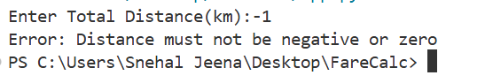
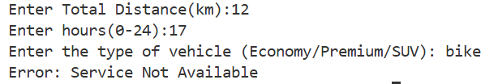
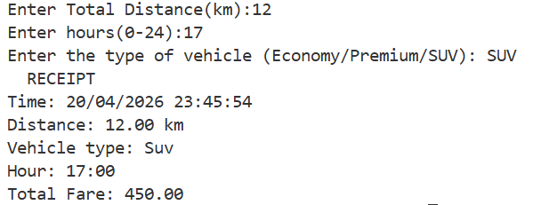

# FareCalc

A Python program to calculate fare using distance,vehicle type and surge pricing.

## Features:

- Supports different types of vehicle
- Peak hour surge pricing
- Custom Error handling

## Industrial Standards Used:

- Modular design
- Exception handling
- Validation of input
- Formatted output generation 

## Program Output

### Output 1

### Output 2

### Output 3
